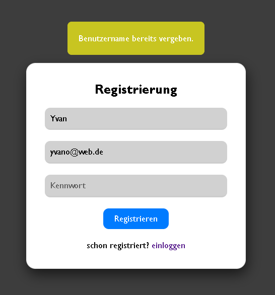

<p align="center">
  
  
  
  
  
  
  
</p>


# 🧩 PHP User Notes App

Eine kompakte Webanwendung in **PHP** mit **Benutzerregistrierung**, **Login** und **persönlicher Notizverwaltung**.
Die App läuft vollständig in Docker‑Containern (PHP/Apache + MariaDB) und nutzt PDO, Prepared Statements und Sessions für sichere Webentwicklung.

---

## 🚀 Funktionen

- 🔐 Benutzerregistrierung mit sicherem Passwort-Hashing (`password_hash()`)
- 🔑 Login mit Session-Authentifizierung (`password_verify()`)
- 💾 Persistente Datenbank über MariaDB‑Container
- 🧠 Persönlicher Account-Bereich (geschützt durch Sessions)
- 📝 Persönliche Notizen pro Benutzer (CRUD‑Funktionalität)
- 🗑️ FOREIGN KEY: Löscht ein Benutzerkonto, werden alle zugehörigen Notizen automatisch entfernt
- ⚡ Automatische DB‑Initialisierung über init.sql beim ersten Start

---

## 🧰 Verwendete Technologien

| Bereich | Technologie |
|----------|--------------|
| Backend | PHP v8.2 (Apache) |
| Datenbank | MariaDB (Docker) |
| Server | Apache (Docker Image) |
| Sicherheit | Passwort-Hashing, Prepared Statements, Sessions |
| Deployment | Docker Compose |

---

## ⚙️ Installation & Setup (Docker)

### 🔸 Voraussetzungen
- Docker + Docker Desktop installieren
- Git (optional)

### 🔸 Schritte

1. **Repository klonen**
   ```bash
   git clone https://github.com/yvanzambou/php-user-notes-app.git

2. **Container starten**:
   ```bash
   docker compose up -d --build

3. **App im Browser öffnen**
      http://localhost:8080

4. **Automatische Datenbankerstellung**
   Beim ersten Start erstellt MariaDB automatisch:
    - die Datenbank userdb
    - die Tabellen **users** und **notes**

---

## 🧑‍💻 Verwendung

1. **Registrieren:**
      - Erstelle ein neues Benutzerkonto unter **/register.php**

2. **Anmelden:**
      - Logge dich über **/index.php** ein

3. **Notizen hinzufügen:**
      - Auf der Benutzerseite (**userAccount.php**) können Texte gespeichert werden. Die Notizen werden automatisch dem eingeloggten Benutzer zugeordnet.

4. **Abmelden:**
      - Beendet die Session und führt zurück zur Login‑Seite.

---

## 🧱 Sicherheit

- Passwörter werden mit password_hash() sicher gespeichert
- Login-Validierung über password_verify()
- Schutz vor SQL‑Injection durch Prepared Statements
- Session-basierte Zugriffskontrolle
- UTF‑8mb4 für vollständige Unicode‑Unterstützung

---

## 🖼️ Screenshots  

<p align="center">
  
  <br>
  <em>Abbildung 1: Registrierungsseite</em>
</p>
<br><br>
<p align="center">
  
  <br>
  <em>Abbildung 2: Anmeldungsseite mit Flash-Message</em>
</p>
<br><br>
<p align="center">
  
  <br>
  <em>Abbildung 3: Anmeldeversuche mit falschen Daten</em>
</p>
<br><br>
<p align="center">
  
  <br>
  <em>Abbildung 4: Anmeldeversuche mit vergebenen Daten</em>
</p>
<br><br>
<p align="center">
  
  <br>
  <em>Abbildung 5: Benutzerseite</em>
</p>
<br><br>
<p align="center">
  
  <br>
  <em>Abbildung 6: Nach erfolgreicher Abmeldung</em>
</p>

---

## 📄 Hinweis  
Dieses Projekt demonstriert moderne PHP‑Grundlagen wie PDO, Sessions, Passwortsicherheit und den Einsatz von Docker für reproduzierbare Entwicklungsumgebungen.  

---

## 👤 Autor  
**Yvan Zambou**  

[](https://linkedin.com/in/yvan-zambou-29aba9261)  
[](https://github.com/yvanzambou)  

---