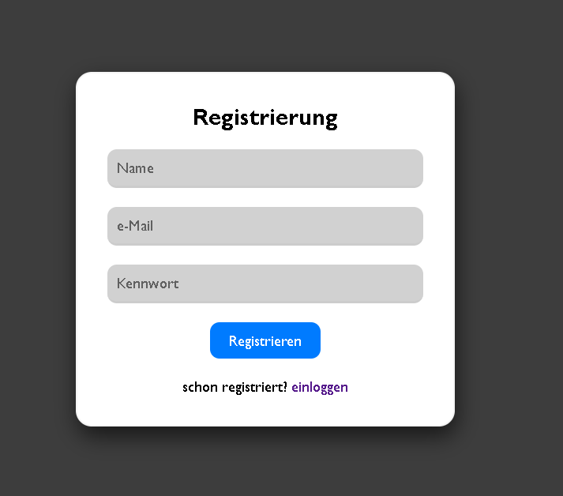
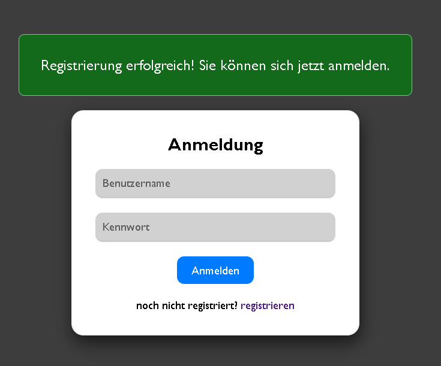
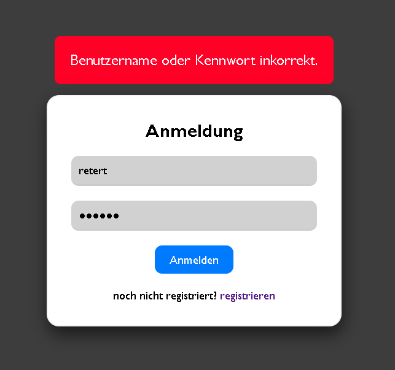
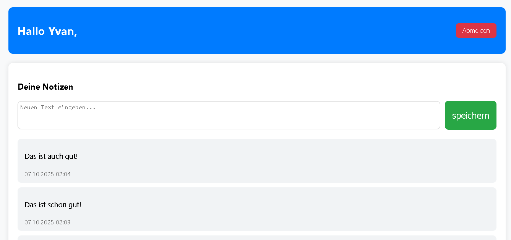
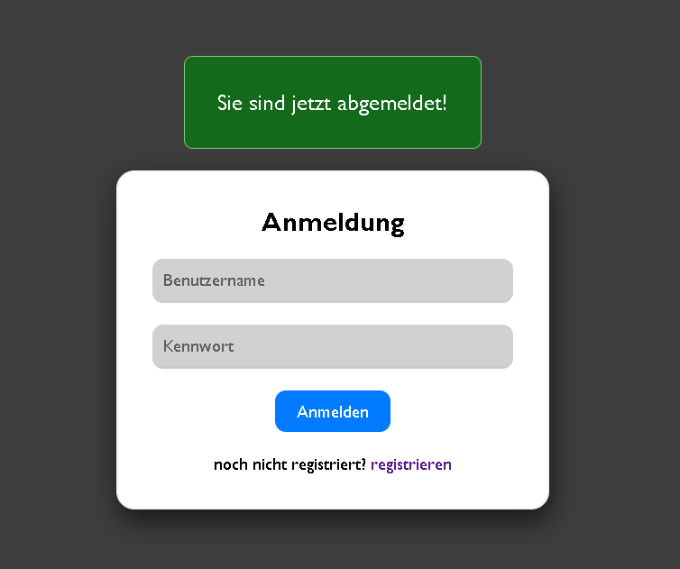

# 🧩 PHP User Notes App

Eine einfache Webanwendung in **PHP** mit **Benutzerregistrierung**, **Login** und **persönlicher Notizverwaltung**.  
Sie wurde mit **PDO** und **MySQL (MariaDB)** entwickelt und eignet sich ideal als Beispielprojekt für moderne PHP-Webentwicklung.

---

## 🚀 Funktionen

- 🔐 Benutzerregistrierung mit Passwort-Hashing (`password_hash()`)
- 🔑 Benutzer-Login mit sicherer Authentifizierung (`password_verify()`)
- 💾 Speicherung der Daten in MySQL über PDO (prepared statements)
- 🧠 Persönlicher Account-Bereich (geschützt durch Sessions)
- 📝 Benutzer kann eigene Texte / Notizen hinzufügen
- 🗑️ Automatische Löschung der Notizen beim Löschen des Benutzers (FOREIGN KEY)
- ⚡ Automatisches Erstellen der Datenbank und Tabellen beim Start

---

## 🧰 Verwendete Technologien

| Bereich | Technologie |
|----------|--------------|
| Backend | PHP v8.2.12 |
| Datenbank | MySQL / MariaDB |
| Server | Apache (in XAMPP) |
| Styling | CSS3 |
| Sicherheit | Passwort-Hashing, Prepared Statements, Sessions |

---

## ⚙️ Installation & Einrichtung

### 🔸 Voraussetzungen
- XAMPP installieren

### 🔸 Schritte

1. **Repository klonen oder herunterladen**
   ```bash
   git clone https://github.com/yvanzambou/php-user-notes-app.git

2. **Projekt in deinen lokalen Serverordner legen**:
      - C:\xampp\htdocs\php-user-notes-app

3. **Server starten**
      - Apache & MySQL in XAMPP starten
      - Im Browser aufrufen: http://localhost/php-user-notes-app/public/

4. **Automatische Datenbankerstellung**
      - Beim ersten Start erstellt das Skript automatisch: die Datenbank **userdb** und die Tabellen **users** und **notes**.

---

## 🧑‍💻 Verwendung

1. **Registrieren:**
      - Erstelle ein neues Benutzerkonto unter **/register.php**

2. **Anmelden:**
      - Logge dich über **/index.php** ein

3. **Notizen hinzufügen:**
      - Auf der Benutzerseite (**userAccount.php**) kannst du Texte über den „speichern“-Button hinzufügen. Diese werden automatisch in der Datenbank gespeichert.

4. **Abmelden:**
      - Über den Button „Abmelden“ wird die aktuelle Session beendet.

---

## 🧱 Sicherheit

- Passwörter werden mit password_hash() sicher gespeichert
- Login-Prüfung mit password_verify()
- Keine SQL-Injections dank Prepared Statements
- Session-basierte Zugriffskontrolle für geschützte Seiten
- UTF-8 / UTF-8mb4 für internationale Zeichenunterstützung

---

## 🖼️ Screenshots  

<p align="center">
  
  <br>
  <em>Abbildung 1: Registrierungsseite</em>
</p>

<p align="center">
  
  <br>
  <em>Abbildung 2: Anmeldungsseite mit Flash-Message</em>
</p>

<p align="center">
  
  <br>
  <em>Abbildung 3: Anmeldeversuche mit falschen Daten</em>
</p>

<p align="center">
  
  <br>
  <em>Abbildung 4: Benutzerseite</em>
</p>
<br><br>
<p align="center">
  
  <br>
  <em>Abbildung 5: Nach erfolgreicher Abmeldung</em>
</p>

---

## 📄 Hinweis  
Dieses Projekt wurde entwickelt, um grundlegende PHP-Fähigkeiten zu demonstrieren — darunter PDO, Sessions, Passwortsicherheit und dynamische Datenbankabfragen.  

---

## 👤 Autor  
**Yvan Zambou**  

[](https://linkedin.com/in/yvan-zambou-29aba9261)  
[](https://github.com/yvanzambou)  

---